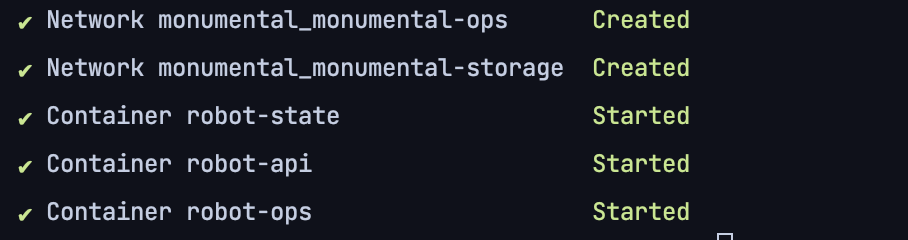

# Robotic Crane Visualisation

> written
> by [Martijn Benjamin](https://www.linkedin.com/in/martijn-benjamin/) ([Appeltje-C](https://github.com/appeltje-c))
> for [Monumental](https://www.monumental.co/)
>

## Intro

This project is my implementation of the Monumental "Visualizing a Robotic Crane" technical assessment.

The project consists of an API, React Application and the Blender crane model in the folders:

* api - A NodeJS project displaying backend technology using MongoDB and Websocket connectivity
* model - The Mesh and armature of the Crane modelled in Blender
* ops - A React Application visualizing the Crane displaying frontend technology using React Three Fiber and the API
  over Websockets for the telemetry data.

## Running the project

The project has been configured to run with Docker. It is possible to run without Docker but requires extra steps to
install MongoDB, seed the data and configure the network. For the sake of brevity this has been left out of the scope of
the implementation. Drop me a message if you want to run it without Docker.

Running the project takes a few steps:

* Make sure Docker is installed running: [https://www.docker.com/get-started/](https://www.docker.com/get-started/)
* Clone the repo and run docker

```shell
git clone https://github.com/appeltje-c/monumental
cd monumental
docker compose up -d
```

When the Docker output reads



the project is running and you can open [http://localhost:3000](http://localhost:3000)

To stop the containers

```shell
docker compose down
```

## What's in the box

There are three main projects

[Monumental Ops](./ops/README.md) : The React App

[Monumental API](./api/README.md) : The API

[Monumental Model](./model/README.md) : The Crane Model

Enjoy!

## Resources

Here is a collection of online resources I used to get familiar with 3D in the browser and Robotics in general.

Rabbit hole warning. ⚠️🤓

> ViewPort<br/>
> https://codesandbox.io/p/sandbox/multiple-views-with-uniform-controls-r9w2ob

> Grid <br/>
> https://codesandbox.io/p/sandbox/grid-component-19uq2u

> Camera <br/>
> https://codesandbox.io/p/sandbox/cameracontrols-basic-sew669

> Mesh Control <br/>
> https://codesandbox.io/p/sandbox/object-gizmo-controls-forked-yxfdlj
> 
> Inverse Kinematics <br/>
> 
> https://medium.com/unity3danimation/overview-of-inverse-kinematics-9769a43ba956
> https://medium.com/unity3danimation/create-your-own-ik-in-unity3d-989debd86770
> 
> 
> https://threejs.org/docs/#examples/en/animations/CCDIKSolver <br/>
> https://www.khanacademy.org/computer-programming/inverse-kinematics-robot-arm/5648684600524800 <br/>
> https://github.com/jsantell/THREE.IK <br/>
> https://github.com/lo-th/fullik <br/>
> https://github.com/wylieconlon/kinematics <br/>
> https://threejs.org/examples/#webgl_loader_collada_kinematics

Robot Projects
https://hackaday.io/project/12989-thor
https://hackaday.io/project/9851-controlling-a-robot-arm-with-blender

https://www.sciencedirect.com/science/article/pii/S187705091831072X

https://github.com/glumb/robot-gui
https://github.com/glumb/kinematics

https://github.com/gkjohnson/closed-chain-ik-js.git
https://github.com/jsdf/BussIK-js
https://github.com/pinglu85/IKSolver-for-threejs/tree/main
https://github.com/notrueblood/FABRIK-for-threejs-and-beyond.git

Promising:
https://tmf-code.github.io/inverse-kinematics/#/three-js


Todo:

1. Setup viewport with websockets and simple model
2. Seed Mongo Data
   https://stackoverflow.com/questions/39348478/initialize-data-on-dockerized-mongo
